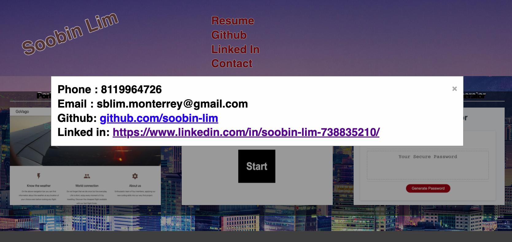

Soobin Lim portfolio for homework 7 (missing)

	* Live link to deployed app
  https://soobin-lim.github.io/portfolio1-missing-/

	* List of technologies used
  Css to show text in the background like an image
  Css and Javascript to show modal popup window(For showing contacts)
  Javascript to add Link to each portfolios

	* 1-2 sentences explaining what the app is
  This is the html, css size-responsive app 
  which contains github, linkedin, two portfolios and one project

	* 2-3 Screenshots 
  
  
